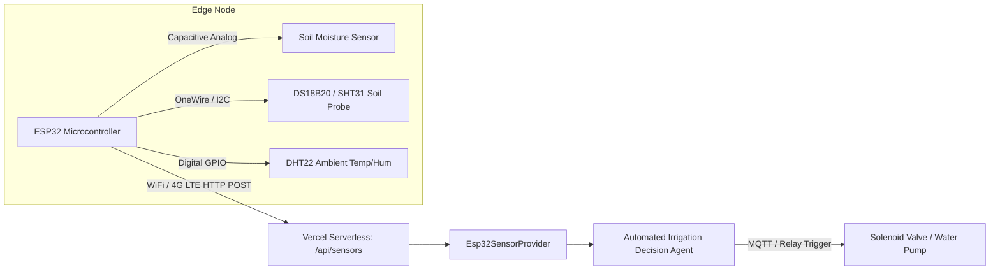

# Automated Irrigation Decision Agent 🌱🤖

> **B.Tech Flexi Credit Academic Project: Agentic AI in Precision Agriculture**  
> Demonstrating multi-step autonomous perception, tool invocation, conflict reconciliation, and explainable irrigation decisions without physical hardware dependencies.

---

## 🌾 Academic Rationale: Why Agentic AI Beats a Single If/Else Moisture Threshold

Conventional precision irrigation systems rely on rigid, naive static thresholds:
```typescript
// Legacy If/Else Approach:
if (soilMoisture < 30) {
  turnPumpOn();
} else {
  turnPumpOff();
}
```

### Critical Flaws of the Legacy Rule-Based Approach:
1. **Rain Disregard (Wasted Resources & Root Rot)**: If soil moisture is 28% but an impending storm will deposit 40 mm of rainfall in 3 hours, a threshold pump triggers immediately, wasting electricity, leaching soil nitrogen, and drowning root systems.
2. **Crop & Phenological Blindness**: 40% moisture is adequate for vegetative wheat, yet catastrophic for silking maize or fruiting tomatoes where water stress induces blossom-end rot.
3. **Soil Texture Ignorance**: In coarse sandy soils with percolation rates $>30\text{ mm/hr}$, field capacity is low (~20%), meaning 25% moisture is saturated. In heavy montmorillonite clay soils, permanent wilting point occurs around 22%, meaning 25% moisture represents severe drought.
4. **Hydraulic Cycle Ignorance**: Rapid repeated cycles without honoring drainage lag induce root hypoxia and fungal infections.

### The Agentic AI Paradigm: 6-Phase Autonomous Loop
The **Automated Irrigation Decision Agent** implements a dynamic multi-step cognitive architecture:
$$\text{Perception} \longrightarrow \text{Tool Use} \longrightarrow \text{Reasoning} \longrightarrow \text{Decision} \longrightarrow \text{Action Recommendation} \longrightarrow \text{Explanation}$$

```mermaid
flowchart TD
    A[📡 Perception: Soil, Crop, Climate] --> B[🛠️ Tool Execution Step 1-5]
    B --> B1[getWeather: Open-Meteo Forecast]
    B --> B2[analyzeSoil: Texture Physics & PWP/FC]
    B --> B3[getCropKnowledge: Stage Sensitivity]
    B --> B4[getIrrigationHistory: Cycle Memory]
    B --> B5[calculateIrrigation: Root-Zone Hydrology]
    B1 & B2 & B3 & B4 & B5 --> C[🧠 Multi-Factor Conflict Reconciliation]
    C --> D[⚖️ Structured Decision: IRRIGATE | WAIT | MONITOR]
    D --> E[📋 Operational Recommendation & Factor Decomposition]
```

The agent reconciles conflicting signals:
- **Dry Soil (28%) + High Rain Probability (85%)** $\rightarrow$ **WAIT** (rely on natural precipitation).
- **Dry Soil (28%) + Clear Skies (10% rain, 31°C)** $\rightarrow$ **IRRIGATE** with precise volumetric calculations.
- **Moderate Soil (48%) + Moderate Rain (40%)** $\rightarrow$ **MONITOR** (evaluate diurnal drift in 6–12 hours).
- **Semi-Aquatic Flooded Paddy Rice (75% moisture, 85% rain)** $\rightarrow$ **WAIT** (standing water layer sufficient).

---

## ✨ System Features

- **Autonomous Tool-Calling Loop**: Uses Vercel AI SDK 7 with multi-step stopping conditions (`isStepCount(8)`), querying 6 specialized domain tools in sequence.
- **Live Tool Streaming Timeline**: Real-time visual progress showing tool inputs, live loading spinners, and structured outputs resolving into checkmarks.
- **4 Stable Demo Grading Presets**: Instant evaluation calibrated for consistent grading:
  - 🌾 **Dry Wheat Field** (28% moisture, 10% rain, 31°C, vegetative) $\rightarrow$ `IRRIGATE`
  - 🍚 **Rainy Rice Field** (75% moisture, 85% rain, 26°C, vegetative) $\rightarrow$ `WAIT`
  - 🍅 **Moderate Tomato Field** (48% moisture, 40% rain, 28°C, fruiting) $\rightarrow$ `MONITOR`
  - 🌿 **Hot Cotton Field** (35% moisture, 15% rain, 36°C, flowering) $\rightarrow$ `IRRIGATE`
- **Polymorphic Sensor Architecture (`SensorDataProvider`)**:
  - `MockSensorProvider`: Generates plausible diurnal sinusoidal drift for temperature, humidity, and moisture.
  - `Esp32SensorProvider`: Production-ready stub validating incoming JSON packets from ESP32 microcontrollers with capacitive soil moisture sensors, DHT22, and RS485 soil probes.
- **Explainable Decision Panel**: Breaks down decisions into observable inputs (crop stage, soil physics, weather condition, ET factor, rain discount) and cross-tool confidence.
- **Zero External API Dependency Crash Resilience**: Automatically falls back to local deterministic models if keys are missing or Open-Meteo/Groq encounters rate limits.
- **Interactive Visualizations**: High-fidelity Recharts graphs for 24-hour telemetry trends, irrigation history, and simulated water savings metrics.

---

## 🛠️ Domain Tools (`src/lib/tools/`)

All tools are strongly typed with Zod input schemas and return structured results:

| Tool | Input Schema | Output Schema | Purpose |
|---|---|---|---|
| `getWeather` | `latitude`, `longitude`, `locationName` | `temperature`, `humidity`, `rainProbability`, `rainfallForecastMm`, `windSpeed`, `condition`, `source` | Queries Open-Meteo REST API (no API key needed) with offline fallback. |
| `analyzeSoil` | `soilMoisture`, `soilType` (sandy/clay/loam), `temp`, `humidity` | `moistureStatus`, `soilCondition`, `estimatedRequirement`, `severity`, `percolationRate` | Computes soil water tension relative to Permanent Wilting Point (PWP) and Field Capacity (FC). |
| `getCropKnowledge` | `crop` (wheat/rice/maize/cotton/tomato/sugarcane), `growthStage`, `soilType` | `preferredMoistureRange`, `waterRequirement`, `sensitivity`, `idealIrrigationConditions` | Structured agronomic database covering 6 crops across 5 phenological stages; handles semi-aquatic paddy rice vs aerobic cereals. |
| `calculateIrrigation` | `currentMoisture`, `targetMoisture`, `cropWaterRequirement`, `fieldSizeHectares`, `temp`, `rainProb`, `daysSinceLastIrrigation` | `recommendedWaterLitres`, `recommendedDurationMinutes`, `urgency`, `calculationFormula`, `isEstimate` | Deterministic root-zone water deficit formula with temperature evapotranspiration factor and rain probability discount. |
| `getIrrigationHistory` | `crop`, `limit` | `events[]`, `summary`, `lastIrrigationDaysAgo` | Memory log of recent applications to prevent pump short-cycling and root hypoxia. |
| `makeDecision` | `decision`, `confidence`, `urgency`, `waterLitres`, `durationMinutes`, `reasoningFactors`, `warnings`, `recommendation` | Structured `IrrigationDecision` object | Synthesizes all tool data into an actionable, explainable operational decision. |

---

## 💻 Tech Stack

- **Framework**: Next.js 16 (App Router, Turbopack, React 19)
- **Language**: TypeScript (Strict Mode enabled, zero `any`)
- **Styling**: Tailwind CSS v4 & Lucide Icons
- **Agentic Orchestration**: Vercel AI SDK 7 (`ai`, `@ai-sdk/groq`, `@ai-sdk/react`, `zod`)
- **Charting**: Recharts 2.15
- **Weather API**: Open-Meteo (zero-key open REST API)
- **Deployment Target**: Vercel (Edge/Serverless compatible)

---

## 📁 Repository Structure

```
├── src/
│   ├── app/
│   │   ├── api/
│   │   │   ├── chat/route.ts        # Multi-step Agent streaming endpoint
│   │   │   ├── field/route.ts       # Field configuration API
│   │   │   ├── history/route.ts     # Irrigation history logs API
│   │   │   └── sensors/route.ts     # Sensor telemetry & drift simulation
│   │   ├── agent/page.tsx           # Interactive AI Agent chat & live timeline
│   │   ├── analytics/page.tsx       # Telemetry charts & water conservation audit
│   │   ├── dashboard/page.tsx       # Live farm monitoring dashboard
│   │   ├── field/page.tsx           # Field & soil configuration sliders
│   │   ├── history/page.tsx         # Historical cycle table & metrics
│   │   ├── settings/page.tsx        # Sensor provider toggle (Mock vs ESP32)
│   │   ├── layout.tsx               # Root layout with responsive navbar & footer
│   │   └── page.tsx                 # Academic landing page & architecture diagram
│   ├── components/
│   │   ├── AgentTimeline.tsx        # Live streaming step-by-step tool timeline
│   │   ├── DecisionCard.tsx         # Structured decision with factors & warnings
│   │   ├── Footer.tsx               # Footer with mandatory academic disclaimer
│   │   ├── Navbar.tsx               # Responsive navigation bar
│   │   ├── PresetSelector.tsx       # 4 Demo grading presets
│   │   └── TelemetryCards.tsx       # Live sensor statistics cards
│   ├── lib/
│   │   ├── agent/
│   │   │   ├── config.ts            # Centralized model & API key configuration
│   │   │   └── prompt.ts            # System prompt with conflict reconciliation rules
│   │   ├── sensors/
│   │   │   ├── types.ts             # SensorDataProvider interface
│   │   │   ├── mockProvider.ts      # Drift-based simulated sensor provider
│   │   │   ├── esp32Provider.ts     # ESP32 hardware packet parser
│   │   │   └── index.ts             # Provider registry
│   │   └── tools/                   # 6 Strongly-typed domain tools
│   │       ├── analyzeSoil.ts
│   │       ├── calculateIrrigation.ts
│   │       ├── getCropKnowledge.ts
│   │       ├── getIrrigationHistory.ts
│   │       ├── getWeather.ts
│   │       ├── makeDecision.ts
│   │       └── index.ts
│   └── types/
│       └── irrigation.ts            # Domain entity types (zero `any`)
├── test-presets.js                  # Automated test validating all 4 grading presets
├── test-weather.js                  # Automated test validating weather & fallback
├── .env.example                     # Environment template without secrets
└── README.md
```

---

## 🚀 Local Setup & Installation

### Prerequisites
- Node.js v18.17+ or v20+ / v22+
- npm or pnpm

### 1. Clone & Install Dependencies
```bash
git clone <repository_url>
cd flexi
npm install
```

### 2. Configure Environment Variables
Copy `.env.example` to `.env.local`:
```bash
cp .env.example .env.local
```

Edit `.env.local` (optional):
```env
# AI Agent Model Configuration (Groq or OpenAI compatible)
AI_API_KEY=your_groq_api_key_here
GROQ_API_KEY=your_groq_api_key_here
AI_MODEL=openai/gpt-oss-20b

# Search / Weather (Open-Meteo requires no key; Tavily is optional)
TAVILY_API_KEY=your_tavily_api_key_here

# Supabase (Optional - in-memory seeded fallback runs automatically if absent)
NEXT_PUBLIC_SUPABASE_URL=
NEXT_PUBLIC_SUPABASE_ANON_KEY=
```
> **Note**: The application is **zero-config ready**. If no API keys are provided, the system boots cleanly and runs its autonomous agronomic multi-step engine without crashing.

### 3. Run Development Server
```bash
npm run dev
```
Open [http://localhost:3000](http://localhost:3000) in your browser.

### 4. Run Automated Preset Tests
```bash
node test-presets.js
node test-weather.js
```

### 5. Production Build Verification
```bash
npm run lint
npm run build
```

---

## 🌐 Vercel Deployment

Deploying to Vercel requires zero physical infrastructure:

1. Push your repository to GitHub / GitLab.
2. Import the project into [Vercel](https://vercel.com).
3. Under **Environment Variables**, optionally supply `AI_API_KEY` or `GROQ_API_KEY`.
4. Click **Deploy**.
5. The project deploys as a serverless Next.js App Router application.

---

## 📡 Future IoT Hardware Integration (ESP32)

While this academic prototype runs in simulation mode, the architecture is designed to be **IoT-Ready**:



To switch to hardware mode:
1. Navigate to **Settings** (`/settings`).
2. Toggle the **Active Sensor Data Provider** from `Mock Data Provider` to `ESP32 Hardware Provider`.
3. Configure your ESP32 firmware to `POST` telemetry JSON packets to `/api/sensors`:
```json
{
  "nodeId": "ESP32-FIELD-01",
  "apiKey": "farm-node-secret-key",
  "soilMoisture": 31.4,
  "temperature": 29.8,
  "humidity": 54.2,
  "batteryVoltage": 3.87,
  "rssi": -68
}
```

---

## ⚠️ Academic Prototype Disclaimer

> **Important**: Irrigation recommendations are generated by an academic AI prototype and should be validated against local agronomic conditions before real-world use. This software is built for demonstration and research purposes in Agentic AI and does not constitute certified agricultural or irrigation engineering advice.
